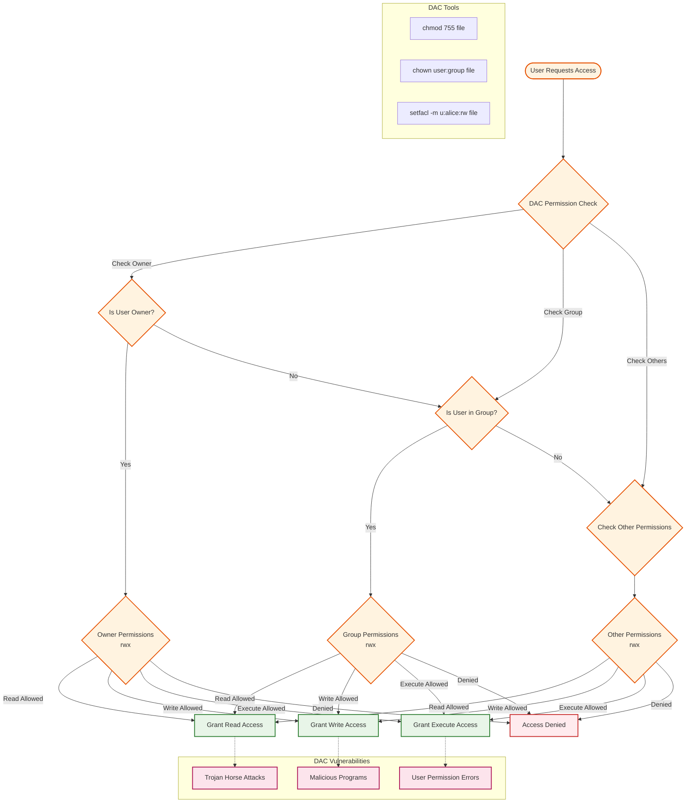
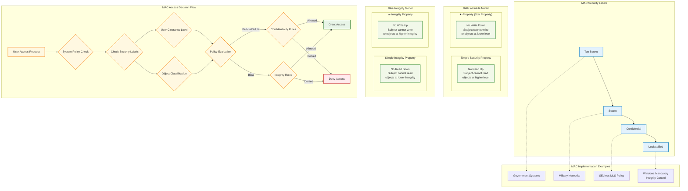
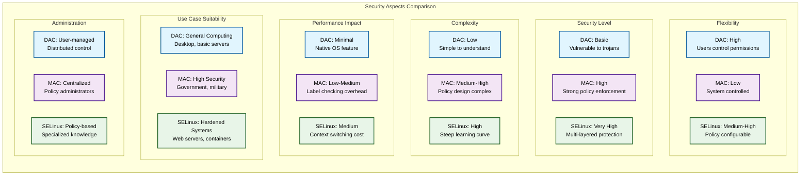

# Access Control Mechanisms - Mermaid Diagrams

## 1. Complete Access Control Comparison Overview

```mermaid
graph TB
    subgraph "Access Control Mechanisms"
        DAC["DAC<br/>Discretionary Access Control"]
        MAC["MAC<br/>Mandatory Access Control"]
        SELINUX["SELinux<br/>Security-Enhanced Linux"]
    end
    
    subgraph "DAC Characteristics"
        DAC --> DAC_OWNER["Owner Controlled"]
        DAC --> DAC_FLEX["High Flexibility"]
        DAC --> DAC_SIMPLE["Simple Implementation"]
        DAC --> DAC_VULN["Vulnerable to Trojans"]
        
        DAC_OWNER --> DAC_UNIX["Unix Permissions<br/>chmod, chown"]
        DAC_OWNER --> DAC_ACL["Access Control Lists<br/>setfacl"]
        DAC_OWNER --> DAC_NTFS["Windows NTFS<br/>Properties"]
    end
    
    subgraph "MAC Characteristics"
        MAC --> MAC_SYSTEM["System Controlled"]
        MAC --> MAC_POLICY["Policy Based"]
        MAC --> MAC_LABEL["Label Based"]
        MAC --> MAC_SECURE["High Security"]
        
        MAC_POLICY --> MAC_BELL["Bell-LaPadula<br/>No Read Up/Write Down"]
        MAC_POLICY --> MAC_BIBA["Biba Model<br/>Integrity Focus"]
        MAC_POLICY --> MAC_MLS["Multi-Level Security<br/>Classifications"]
    end
    
    subgraph "SELinux Characteristics"
        SELINUX --> SEL_TE["Type Enforcement"]
        SELINUX --> SEL_RBAC["Role-Based Access"]
        SELINUX --> SEL_MLS_OPT["Optional MLS"]
        SELINUX --> SEL_FINE["Fine-Grained Control"]
        
        SEL_TE --> SEL_DOMAIN["Process Domains"]
        SEL_TE --> SEL_TYPE["Object Types"]
        SEL_RBAC --> SEL_USER["SELinux Users"]
        SEL_RBAC --> SEL_ROLE["SELinux Roles"]
    end
    
    subgraph "Security Levels"
        BASIC["Basic Security<br/>DAC"]
        HIGH["High Security<br/>MAC"]
        VERYHIGH["Very High Security<br/>SELinux"]
        
        BASIC --> |Escalates to| HIGH
        HIGH --> |Enhanced by| VERYHIGH
    end
    
    subgraph "Use Cases"
        GENERAL["General Computing<br/>Desktop/Server"]
        CLASSIFIED["Classified Systems<br/>Government/Military"]
        HARDENED["Hardened Linux<br/>Web Servers/Containers"]
        
        DAC -.-> GENERAL
        MAC -.-> CLASSIFIED
        SELINUX -.-> HARDENED
    end
    
    classDef dacStyle fill:#e1f5fe,stroke:#01579b,stroke-width:2px
    classDef macStyle fill:#f3e5f5,stroke:#4a148c,stroke-width:2px
    classDef selinuxStyle fill:#e8f5e8,stroke:#1b5e20,stroke-width:2px
    
    class DAC,DAC_OWNER,DAC_FLEX,DAC_SIMPLE,DAC_VULN,DAC_UNIX,DAC_ACL,DAC_NTFS,BASIC,GENERAL dacStyle
    class MAC,MAC_SYSTEM,MAC_POLICY,MAC_LABEL,MAC_SECURE,MAC_BELL,MAC_BIBA,MAC_MLS,HIGH,CLASSIFIED macStyle
    class SELINUX,SEL_TE,SEL_RBAC,SEL_MLS_OPT,SEL_FINE,SEL_DOMAIN,SEL_TYPE,SEL_USER,SEL_ROLE,VERYHIGH,HARDENED selinuxStyle
```



## 2. DAC (Discretionary Access Control) Detailed Flow



## 3. MAC (Mandatory Access Control) Security Model



## 4. SELinux Architecture and Components

```mermaid
graph TB
    subgraph "SELinux Architecture"
        subgraph "User Space"
            APP[Applications]
            SELINUX_UTILS[SELinux Utilities<br/>sestatus, setsebool, etc.]
            POLICY_TOOLS[Policy Tools<br/>audit2allow, checkpolicy]
        end
        
        subgraph "Kernel Space"
            LSM[Linux Security Module<br/>Framework]
            SELINUX_MODULE[SELinux Module]
            AVC[Access Vector Cache]
            SECURITY_SERVER[Security Server]
        end
        
        subgraph "Policy Store"
            POLICY_DB[(Policy Database)]
            CONTEXTS[Security Contexts]
            RULES[Access Rules]
        end
    end
    
    APP --> LSM
    LSM --> SELINUX_MODULE
    SELINUX_MODULE --> AVC
    AVC --> SECURITY_SERVER
    SECURITY_SERVER --> POLICY_DB
    POLICY_DB --> CONTEXTS
    POLICY_DB --> RULES
    
    subgraph "SELinux Security Context"
        CONTEXT["user:role:type:level<br/>system_u:object_r:httpd_exec_t:s0"]
        
        CONTEXT --> USER_COMP[User Component<br/>system_u, user_u, root]
        CONTEXT --> ROLE_COMP[Role Component<br/>object_r, system_r, user_r]
        CONTEXT --> TYPE_COMP[Type Component<br/>httpd_exec_t, etc_t]
        CONTEXT --> LEVEL_COMP[Level Component<br/>s0, s0:c0.c1023]
    end
    
    subgraph "SELinux Modes"
        ENFORCING[Enforcing Mode<br/>Policies enforced<br/>Violations blocked]
        PERMISSIVE[Permissive Mode<br/>Policies not enforced<br/>Violations logged]
        DISABLED[Disabled Mode<br/>SELinux turned off]
        
        ENFORCING --> |setenforce 0| PERMISSIVE
        PERMISSIVE --> |setenforce 1| ENFORCING
        ENFORCING --> |Edit /etc/selinux/config| DISABLED
        DISABLED --> |Edit /etc/selinux/config<br/>Reboot required| ENFORCING
    end
    
    subgraph "Type Enforcement Model"
        SUBJECT[Subject<br/>Process/Domain]
        OBJECT[Object<br/>File/Socket/etc.]
        ACTION[Action<br/>read, write, execute]
        
        SUBJECT --> |wants to perform| ACTION
        ACTION --> |on| OBJECT
        
        TE_RULE[Type Enforcement Rule<br/>allow httpd_t httpd_config_t:file read;]
        
        ACTION -.-> TE_RULE
    end
    
    subgraph "SELinux Tools and Commands"
        SESTATUS[sestatus<br/>Check SELinux status]
        LS_Z[ls -Z<br/>View file contexts]
        PS_Z[ps -eZ<br/>View process contexts]
        CHCON[chcon<br/>Change context]
        RESTORECON[restorecon<br/>Restore default context]
        SETSEBOOL[setsebool<br/>Set boolean values]
        AUDIT2ALLOW[audit2allow<br/>Generate policy from logs]
        SEMODULE[semodule<br/>Manage policy modules]
    end
    
    classDef userSpaceStyle fill:#e1f5fe,stroke:#0277bd,stroke-width:2px
    classDef kernelStyle fill:#f3e5f5,stroke:#7b1fa2,stroke-width:2px
    classDef policyStyle fill:#e8f5e8,stroke:#388e3c,stroke-width:2px
    classDef contextStyle fill:#fff3e0,stroke:#f57c00,stroke-width:2px
    classDef modeStyle fill:#fce4ec,stroke:#c2185b,stroke-width:2px
    classDef toolStyle fill:#f1f8e9,stroke:#558b2f,stroke-width:2px
    
    class APP,SELINUX_UTILS,POLICY_TOOLS userSpaceStyle
    class LSM,SELINUX_MODULE,AVC,SECURITY_SERVER kernelStyle
    class POLICY_DB,CONTEXTS,RULES policyStyle
    class CONTEXT,USER_COMP,ROLE_COMP,TYPE_COMP,LEVEL_COMP contextStyle
    class ENFORCING,PERMISSIVE,DISABLED modeStyle
    class SESTATUS,LS_Z,PS_Z,CHCON,RESTORECON,SETSEBOOL,AUDIT2ALLOW,SEMODULE toolStyle
```



## 5. Access Control Decision Flow Comparison

```mermaid
flowchart TD
    REQUEST[Access Request] --> DAC_PATH{DAC Check}
    REQUEST --> MAC_PATH{MAC Check}  
    REQUEST --> SELINUX_PATH{SELinux Check}
    
    subgraph "DAC Decision Path"
        DAC_PATH --> DAC_OWNER_CHECK{Owner?}
        DAC_OWNER_CHECK --> |Yes| DAC_OWNER_PERM[Check Owner Permissions]
        DAC_OWNER_CHECK --> |No| DAC_GROUP_CHECK{In Group?}
        DAC_GROUP_CHECK --> |Yes| DAC_GROUP_PERM[Check Group Permissions]
        DAC_GROUP_CHECK --> |No| DAC_OTHER_PERM[Check Other Permissions]
        
        DAC_OWNER_PERM --> DAC_DECISION{Allow?}
        DAC_GROUP_PERM --> DAC_DECISION
        DAC_OTHER_PERM --> DAC_DECISION
        
        DAC_DECISION --> |Yes| DAC_ALLOW[DAC: Allow]
        DAC_DECISION --> |No| DAC_DENY[DAC: Deny]
    end
    
    subgraph "MAC Decision Path"
        MAC_PATH --> MAC_LABEL_CHECK[Check Security Labels]
        MAC_LABEL_CHECK --> MAC_CLEARANCE[User Clearance Level]
        MAC_CLEARANCE --> MAC_POLICY_EVAL{Policy Evaluation}
        MAC_POLICY_EVAL --> MAC_BELL[Bell-LaPadula Rules]
        MAC_POLICY_EVAL --> MAC_BIBA[Biba Rules]
        
        MAC_BELL --> MAC_DECISION{System Policy<br/>Allow?}
        MAC_BIBA --> MAC_DECISION
        
        MAC_DECISION --> |Yes| MAC_ALLOW[MAC: Allow]
        MAC_DECISION --> |No| MAC_DENY[MAC: Deny]
    end
    
    subgraph "SELinux Decision Path"
        SELINUX_PATH --> SEL_AVC_CHECK{AVC Cache Hit?}
        SEL_AVC_CHECK --> |Yes| SEL_CACHED_DECISION[Use Cached Decision]
        SEL_AVC_CHECK --> |No| SEL_SECURITY_SERVER[Query Security Server]
        
        SEL_SECURITY_SERVER --> SEL_CONTEXT_CHECK[Check Security Contexts]
        SEL_CONTEXT_CHECK --> SEL_TE[Type Enforcement Rules]
        SEL_CONTEXT_CHECK --> SEL_RBAC[RBAC Rules]
        SEL_CONTEXT_CHECK --> SEL_MLS[MLS Rules (if enabled)]
        
        SEL_TE --> SEL_POLICY_DECISION{All Rules<br/>Allow?}
        SEL_RBAC --> SEL_POLICY_DECISION
        SEL_MLS --> SEL_POLICY_DECISION
        SEL_CACHED_DECISION --> SEL_FINAL_DECISION{Final Decision}
        
        SEL_POLICY_DECISION --> |Yes| SEL_CACHE_ALLOW[Cache & Allow]
        SEL_POLICY_DECISION --> |No| SEL_CACHE_DENY[Cache & Deny]
        
        SEL_CACHE_ALLOW --> SEL_ALLOW[SELinux: Allow]
        SEL_CACHE_DENY --> SEL_DENY[SELinux: Deny]
        
        SEL_CACHE_ALLOW --> SEL_AVC_UPDATE[Update AVC Cache]
        SEL_CACHE_DENY --> SEL_AVC_UPDATE
        
        SEL_ALLOW --> SEL_FINAL_DECISION
        SEL_DENY --> SEL_FINAL_DECISION
    end
    
    subgraph "Combined Decision"
        COMBINED_LOGIC{All Systems<br/>Must Allow}
        
        DAC_ALLOW --> COMBINED_LOGIC
        MAC_ALLOW --> COMBINED_LOGIC
        SEL_ALLOW --> COMBINED_LOGIC
        
        DAC_DENY --> FINAL_DENY[Final: Access Denied]
        MAC_DENY --> FINAL_DENY
        SEL_DENY --> FINAL_DENY
        
        COMBINED_LOGIC --> |All Allow| FINAL_ALLOW[Final: Access Granted]
        COMBINED_LOGIC --> |Any Deny| FINAL_DENY
    end
    
    classDef dacStyle fill:#e1f5fe,stroke:#01579b,stroke-width:2px
    classDef macStyle fill:#f3e5f5,stroke:#4a148c,stroke-width:2px
    classDef selinuxStyle fill:#e8f5e8,stroke:#1b5e20,stroke-width:2px
    classDef allowStyle fill:#c8e6c9,stroke:#2e7d32,stroke-width:2px
    classDef denyStyle fill:#ffcdd2,stroke:#c62828,stroke-width:2px
    classDef decisionStyle fill:#fff9c4,stroke:#f9a825,stroke-width:2px
    
    class DAC_PATH,DAC_OWNER_CHECK,DAC_GROUP_CHECK,DAC_OWNER_PERM,DAC_GROUP_PERM,DAC_OTHER_PERM,DAC_DECISION dacStyle
    class MAC_PATH,MAC_LABEL_CHECK,MAC_CLEARANCE,MAC_POLICY_EVAL,MAC_BELL,MAC_BIBA,MAC_DECISION macStyle
    class SELINUX_PATH,SEL_AVC_CHECK,SEL_CACHED_DECISION,SEL_SECURITY_SERVER,SEL_CONTEXT_CHECK,SEL_TE,SEL_RBAC,SEL_MLS,SEL_POLICY_DECISION,SEL_CACHE_ALLOW,SEL_CACHE_DENY,SEL_AVC_UPDATE,SEL_FINAL_DECISION selinuxStyle
    class DAC_ALLOW,MAC_ALLOW,SEL_ALLOW,FINAL_ALLOW allowStyle
    class DAC_DENY,MAC_DENY,SEL_DENY,FINAL_DENY denyStyle
    class COMBINED_LOGIC decisionStyle
```

## 6. Security Comparison Matrix



## Usage Instructions

To view these diagrams:

1. **Copy the Mermaid code** from any section above
2. **Paste into a Mermaid renderer** such as:
   - [Mermaid Live Editor](https://mermaid.live)
   - GitHub (supports Mermaid in markdown)
   - VS Code with Mermaid extensions
   - Documentation platforms like GitLab, Notion, etc.

3. **Diagram Descriptions:**
   - **Diagram 1**: Complete overview of all three access control mechanisms
   - **Diagram 2**: Detailed DAC decision flow and vulnerabilities
   - **Diagram 3**: MAC security models with Bell-LaPadula and Biba
   - **Diagram 4**: SELinux architecture and components
   - **Diagram 5**: Comparative access decision flows
   - **Diagram 6**: Security aspects comparison matrix

Each diagram uses color coding:
- **Blue**: DAC-related components
- **Purple**: MAC-related components  
- **Green**: SELinux-related components
- **Orange/Yellow**: Process flows and decisions
- **Red**: Denials and vulnerabilities
- **Light Green**: Access grants
