# Access Control Mechanisms - Mermaid Diagrams

## 1. Complete Access Control Comparison Overview

## 2. DAC (Discretionary Access Control) Detailed Flow

## 3. MAC (Mandatory Access Control) Security Model

```mermaid
graph TB
    subgraph "MAC Security Labels"
        TS[Top Secret]
        S[Secret]
        C[Confidential]
        U[Unclassified]
        
        TS --> S --> C --> U
    end
    
    subgraph "Bell-LaPadula Model"
        subgraph "Simple Security Property"
            NO_READ_UP["No Read Up<br/>Subject cannot read<br/>objects at higher level"]
        end
        
        subgraph "★-Property (Star Property)"
            NO_WRITE_DOWN["No Write Down<br/>Subject cannot write<br/>to objects at lower level"]
        end
    end
    
    subgraph "Biba Integrity Model"
        subgraph "Simple Integrity Property"
            NO_READ_DOWN["No Read Down<br/>Subject cannot read<br/>objects at lower integrity"]
        end
        
        subgraph "★-Integrity Property"
            NO_WRITE_UP["No Write Up<br/>Subject cannot write<br/>to objects at higher integrity"]
        end
    end
    
    subgraph "MAC Access Decision Flow"
        USER_REQUEST[User Access Request] --> SYSTEM_CHECK{System Policy Check}
        
        SYSTEM_CHECK --> LABEL_CHECK{Check Security Labels}
        LABEL_CHECK --> CLEARANCE{User Clearance Level}
        LABEL_CHECK --> OBJECT_CLASS{Object Classification}
        
        CLEARANCE --> POLICY_EVAL{Policy Evaluation}
        OBJECT_CLASS --> POLICY_EVAL
        
        POLICY_EVAL --> |Bell-LaPadula| CONF_CHECK{Confidentiality Rules}
        POLICY_EVAL --> |Biba| INT_CHECK{Integrity Rules}
        
        CONF_CHECK --> |Allowed| GRANT_ACCESS[Grant Access]
        CONF_CHECK --> |Denied| DENY_ACCESS[Deny Access]
        INT_CHECK --> |Allowed| GRANT_ACCESS
        INT_CHECK --> |Denied| DENY_ACCESS
    end
    
    subgraph "MAC Implementation Examples"
        GOV[Government Systems]
        MIL[Military Networks]
        SELINUX_MLS[SELinux MLS Policy]
        WIN_MIC[Windows Mandatory<br/>Integrity Control]
    end
    
    TS -.-> GOV
    S -.-> MIL
    C -.-> SELINUX_MLS
    U -.-> WIN_MIC
    
    classDef labelStyle fill:#e3f2fd,stroke:#0277bd,stroke-width:2px
    classDef ruleStyle fill:#f1f8e9,stroke:#388e3c,stroke-width:2px
    classDef processStyle fill:#fff8e1,stroke:#f57c00,stroke-width:2px
    classDef grantStyle fill:#e8f5e8,stroke:#2e7d32,stroke-width:2px
    classDef denyStyle fill:#ffebee,stroke:#c62828,stroke-width:2px
    
    class TS,S,C,U labelStyle
    class NO_READ_UP,NO_WRITE_DOWN,NO_READ_DOWN,NO_WRITE_UP ruleStyle
    class USER_REQUEST,SYSTEM_CHECK,LABEL_CHECK,CLEARANCE,OBJECT_CLASS,POLICY_EVAL,CONF_CHECK,INT_CHECK processStyle
    class GRANT_ACCESS grantStyle
    class DENY_ACCESS denyStyle
```

## 4. SELinux Architecture and Components

## 5. Access Control Decision Flow Comparison

```mermaid
flowchart TD
    REQUEST[Access Request] --> DAC_CHECK{DAC Check}
    REQUEST --> MAC_CHECK{MAC Check}
    REQUEST --> SEL_CHECK{SELinux Check}
    
    %% DAC Decision Path
    subgraph "DAC_FLOW [DAC Decision Flow]"
        DAC_CHECK --> DAC_OWNER{Is User Owner?}
        DAC_OWNER -->|Yes| DAC_OWNER_PERM[Check Owner Permissions]
        DAC_OWNER -->|No| DAC_GROUP{In Group?}
        DAC_GROUP -->|Yes| DAC_GROUP_PERM[Check Group Permissions]
        DAC_GROUP -->|No| DAC_OTHER_PERM[Check Other Permissions]
        
        DAC_OWNER_PERM --> DAC_RESULT{Permission Granted?}
        DAC_GROUP_PERM --> DAC_RESULT
        DAC_OTHER_PERM --> DAC_RESULT
        
        DAC_RESULT -->|Yes| DAC_ALLOW[DAC: ALLOW]
        DAC_RESULT -->|No| DAC_DENY[DAC: DENY]
    end
    
    %% MAC Decision Path  
    subgraph "MAC_FLOW [MAC Decision Flow]"
        MAC_CHECK --> MAC_LABELS[Check Security Labels]
        MAC_LABELS --> MAC_CLEARANCE[User Clearance Level]
        MAC_LABELS --> MAC_CLASSIFICATION[Object Classification]
        
        MAC_CLEARANCE --> MAC_RULES{Policy Rules}
        MAC_CLASSIFICATION --> MAC_RULES
        
        MAC_RULES --> MAC_BELL[Bell-LaPadula Check]
        MAC_RULES --> MAC_BIBA[Biba Integrity Check]
        
        MAC_BELL --> MAC_RESULT{System Policy Allow?}
        MAC_BIBA --> MAC_RESULT
        
        MAC_RESULT -->|Yes| MAC_ALLOW[MAC: ALLOW]
        MAC_RESULT -->|No| MAC_DENY[MAC: DENY]
    end
    
    %% SELinux Decision Path
    subgraph "SEL_FLOW [SELinux Decision Flow]"
        SEL_CHECK --> SEL_AVC{AVC Cache Hit?}
        
        SEL_AVC -->|Yes| SEL_CACHED[Use Cached Result]
        SEL_AVC -->|No| SEL_SERVER[Query Security Server]
        
        SEL_SERVER --> SEL_CONTEXT[Check Security Contexts]
        SEL_CONTEXT --> SEL_RULES[Evaluate Policy Rules]
        
        SEL_RULES --> SEL_TE[Type Enforcement]
        SEL_RULES --> SEL_RBAC[RBAC Check]
        SEL_RULES --> SEL_MLS[MLS Check]
        
        SEL_TE --> SEL_DECISION{All Rules Allow?}
        SEL_RBAC --> SEL_DECISION
        SEL_MLS --> SEL_DECISION
        
        SEL_DECISION -->|Yes| SEL_CACHE_ALLOW[Cache Allow & Grant]
        SEL_DECISION -->|No| SEL_CACHE_DENY[Cache Deny & Block]
        
        SEL_CACHED --> SEL_FINAL_RESULT{Cached Decision}
        SEL_CACHE_ALLOW --> SEL_ALLOW[SELinux: ALLOW]
        SEL_CACHE_DENY --> SEL_DENY[SELinux: DENY]
        SEL_FINAL_RESULT -->|Allow| SEL_ALLOW
        SEL_FINAL_RESULT -->|Deny| SEL_DENY
    end
    
    %% Combined Final Decision
    subgraph "FINAL_LOGIC [Final Access Decision]"
        GATE_LOGIC{All Systems Must Allow}
        
        FINAL_GRANT[🟢 ACCESS GRANTED]
        FINAL_BLOCK[🔴 ACCESS DENIED]
    end
    
    %% Connect outputs to final decision
    DAC_ALLOW --> GATE_LOGIC
    MAC_ALLOW --> GATE_LOGIC
    SEL_ALLOW --> GATE_LOGIC
    
    DAC_DENY --> FINAL_BLOCK
    MAC_DENY --> FINAL_BLOCK
    SEL_DENY --> FINAL_BLOCK
    
    GATE_LOGIC -->|All Allow| FINAL_GRANT
    GATE_LOGIC -->|Any Deny| FINAL_BLOCK
    
    %% Styling
    classDef dacStyle fill:#e1f5fe,stroke:#0277bd,stroke-width:2px,color:#000
    classDef macStyle fill:#f3e5f5,stroke:#7b1fa2,stroke-width:2px,color:#000
    classDef selinuxStyle fill:#e8f5e8,stroke:#2e7d32,stroke-width:2px,color:#000
    classDef allowStyle fill:#c8e6c9,stroke:#1b5e20,stroke-width:3px,color:#000
    classDef denyStyle fill:#ffcdd2,stroke:#c62828,stroke-width:3px,color:#000
    classDef decisionStyle fill:#fff3e0,stroke:#f57c00,stroke-width:2px,color:#000
    classDef processStyle fill:#f5f5f5,stroke:#616161,stroke-width:1px,color:#000
    
    %% Apply styles
    class DAC_CHECK,DAC_OWNER,DAC_GROUP,DAC_OWNER_PERM,DAC_GROUP_PERM,DAC_OTHER_PERM,DAC_RESULT dacStyle
    class MAC_CHECK,MAC_LABELS,MAC_CLEARANCE,MAC_CLASSIFICATION,MAC_RULES,MAC_BELL,MAC_BIBA,MAC_RESULT macStyle
    class SEL_CHECK,SEL_AVC,SEL_CACHED,SEL_SERVER,SEL_CONTEXT,SEL_RULES,SEL_TE,SEL_RBAC,SEL_MLS,SEL_DECISION,SEL_CACHE_ALLOW,SEL_CACHE_DENY,SEL_FINAL_RESULT selinuxStyle
    class DAC_ALLOW,MAC_ALLOW,SEL_ALLOW,FINAL_GRANT allowStyle
    class DAC_DENY,MAC_DENY,SEL_DENY,FINAL_BLOCK denyStyle
    class GATE_LOGIC decisionStyle
    class REQUEST processStyle
```

## 6. Security Comparison Matrix

## Usage Instructions

To view these diagrams:

1. **Copy the Mermaid code** from any section above
2. **Paste into a Mermaid renderer** such as:
   - [Mermaid Live Editor](https://mermaid.live)
   - GitHub (supports Mermaid in markdown)
   - VS Code with Mermaid extensions
   - Documentation platforms like GitLab, Notion, etc.

3. **Diagram Descriptions:**
   - **Diagram 1**: Complete overview of all three access control mechanisms
   - **Diagram 2**: Detailed DAC decision flow and vulnerabilities
   - **Diagram 3**: MAC security models with Bell-LaPadula and Biba
   - **Diagram 4**: SELinux architecture and components
   - **Diagram 5**: Comparative access decision flows
   - **Diagram 6**: Security aspects comparison matrix

Each diagram uses color coding:
- **Blue**: DAC-related components
- **Purple**: MAC-related components  
- **Green**: SELinux-related components
- **Orange/Yellow**: Process flows and decisions
- **Red**: Denials and vulnerabilities
- **Light Green**: Access grants
