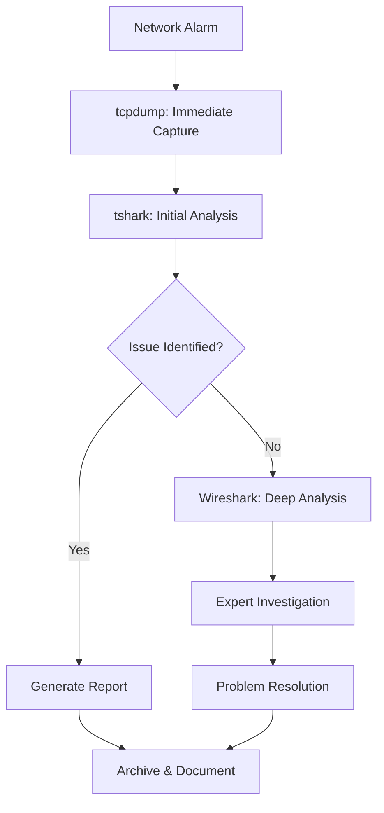

# tcpdump + tshark + Wireshark: Complete Telco Network Analysis Workflow

## Table of Contents
- [Tool Overview and Roles](#tool-overview-and-roles)
- [Real-World Telco Workflow](#real-world-telco-workflow)
- [Production Infrastructure Setup](#production-infrastructure-setup)
- [Protocol-Specific Analysis Chains](#protocol-specific-analysis-chains)
- [Automated Analysis Pipelines](#automated-analysis-pipelines)
- [Remote Analysis and Collaboration](#remote-analysis-and-collaboration)
- [Performance Optimization](#performance-optimization)
- [Integration with Telco Systems](#integration-with-telco-systems)
- [Troubleshooting Scenarios](#troubleshooting-scenarios)
- [Best Practices and Recommendations](#best-practices-and-recommendations)

## Tool Overview and Roles

### The Three-Tier Architecture

```
┌─────────────────────────────────────────────────────────────┐
│                    TELCO NETWORK ANALYSIS STACK            │
├─────────────────────────────────────────────────────────────┤
│ TIER 1: CAPTURE (Production Servers/Network Elements)      │
│ • tcpdump: High-performance packet capture                 │
│ • Minimal processing, maximum throughput                   │
│ • Ring buffers, automated rotation                         │
├─────────────────────────────────────────────────────────────┤
│ TIER 2: ANALYSIS (Analysis Servers/SOC)                    │
│ • tshark: Automated analysis, filtering, statistics        │
│ • Protocol dissection, field extraction                    │
│ • Batch processing, scripted analysis                      │
├─────────────────────────────────────────────────────────────┤
│ TIER 3: VISUALIZATION (Engineer Workstations)              │
│ • Wireshark: Interactive analysis, deep inspection         │
│ • Protocol trees, flow graphs, statistics                  │
│ • Problem isolation, root cause analysis                   │
└─────────────────────────────────────────────────────────────┘
```

### Tool Strengths and Use Cases

| Tool | Primary Use | Telco Scenario | Performance |
|------|-------------|----------------|-------------|
| **tcpdump** | Real-time capture | Production monitoring, incident response | High throughput, low overhead |
| **tshark** | Automated analysis | SOC analysis, report generation, filtering | Medium throughput, protocol-aware |
| **Wireshark** | Interactive investigation | Root cause analysis, protocol debugging | Low throughput, rich visualization |

## Real-World Telco Workflow

### Typical Incident Response Workflow



### 1. **Capture Phase (tcpdump)**
```bash
# Production capture with ring buffers
sudo tcpdump -i any -C 100 -W 50 -w /captures/incident_$(date +%Y%m%d_%H%M%S).pcap \
    'host 10.1.1.100 or (port 5060 or port 5061 or port 2123)'
```

### 2. **Initial Analysis Phase (tshark)**
```bash
# Quick protocol distribution analysis
tshark -r incident_20240821_143022.pcap -q -z io,phs

# Extract SIP call flows
tshark -r incident_20240821_143022.pcap -Y "sip" -T fields \
    -e frame.time -e ip.src -e ip.dst -e sip.Method -e sip.Status-Code
```

### 3. **Deep Investigation Phase (Wireshark)**
- Load filtered data for interactive analysis
- Use protocol hierarchy, flow graphs, and expert information
- Collaborate with remote teams using CloudShark or similar

## Production Infrastructure Setup

### Multi-Server Architecture

```
┌─────────────────┐    ┌─────────────────┐    ┌─────────────────┐
│ CAPTURE SERVERS │    │ ANALYSIS SERVERS│    │ WORKSTATIONS    │
│                 │    │                 │    │                 │
│ • tcpdump       │───▶│ • tshark        │───▶│ • Wireshark     │
│ • Ring buffers  │    │ • Automated     │    │ • Interactive   │
│ • 24/7 capture  │    │   analysis      │    │   analysis      │
│ • Minimal CPU   │    │ • Report gen    │    │ • Visualization │
└─────────────────┘    └─────────────────┘    └─────────────────┘
```

### Capture Server Configuration
```bash
#!/bin/bash
# /etc/systemd/system/telco-capture.service

[Unit]
Description=Telco Network Capture Service
After=network.target

[Service]
Type=forking
User=capture-user
Group=capture-group
ExecStart=/usr/local/bin/start-telco-captures.sh
ExecStop=/usr/local/bin/stop-telco-captures.sh
Restart=always
RestartSec=10

[Install]
WantedBy=multi-user.target
```

### Analysis Server Setup
```bash
#!/bin/bash
# /usr/local/bin/analysis-pipeline.sh

CAPTURE_DIR="/shared/captures"
ANALYSIS_DIR="/shared/analysis"
ARCHIVE_DIR="/shared/archive"

# Process new captures every 5 minutes
while true; do
    for pcap_file in "$CAPTURE_DIR"/*.pcap; do
        if [[ -f "$pcap_file" ]]; then
            analyze_capture "$pcap_file"
            mv "$pcap_file" "$ARCHIVE_DIR/"
        fi
    done
    sleep 300
done

analyze_capture() {
    local file="$1"
    local basename=$(basename "$file" .pcap)
    
    # Generate analysis reports
    generate_protocol_stats "$file" > "$ANALYSIS_DIR/${basename}_protocols.txt"
    generate_sip_analysis "$file" > "$ANALYSIS_DIR/${basename}_sip.txt"
    generate_diameter_analysis "$file" > "$ANALYSIS_DIR/${basename}_diameter.txt"
    
    # Alert on anomalies
    check_for_anomalies "$file"
}
```

## Protocol-Specific Analysis Chains

### 1. SIP/VoIP Analysis Workflow

#### **Capture** (tcpdump)
```bash
# Capture SIP signaling and RTP media
sudo tcpdump -i any -n '((port 5060 or port 5061) or (portrange 10000-20000))' \
    -w sip_voip_capture.pcap
```

#### **Analysis** (tshark)
```bash
# Extract SIP call statistics
tshark -r sip_voip_capture.pcap -q -z sip,stat

# Generate call flow summary
tshark -r sip_voip_capture.pcap -Y "sip.Method or sip.Status-Code" \
    -T fields -e frame.time_relative -e ip.src -e ip.dst \
    -e sip.Method -e sip.Status-Code -e sip.Call-ID

# RTP quality analysis
tshark -r sip_voip_capture.pcap -Y "rtp" -q -z rtp,streams

# Extract failed calls
tshark -r sip_voip_capture.pcap -Y "sip.Status-Code >= 400" \
    -T fields -e sip.Call-ID -e sip.Status-Code -e sip.Status-Line
```

#### **Visualization** (Wireshark)
```bash
# Open with SIP-specific display filters
wireshark -r sip_voip_capture.pcap -Y "sip.Method == INVITE"

# Or create a custom profile for VoIP analysis
# Tools → Configuration Profiles → Create VoIP Profile
```

### 2. Diameter Protocol Analysis

#### **Capture** (tcpdump)
```bash
# Capture Diameter traffic (multiple application ports)
sudo tcpdump -i any -n '(port 3868 or port 3869 or port 3870)' -w diameter.pcap
```

#### **Analysis** (tshark)
```bash
# Diameter command statistics
tshark -r diameter.pcap -q -z diameter,avp

# Extract authentication requests/responses
tshark -r diameter.pcap -Y "diameter.cmd.code == 268" \
    -T fields -e frame.time -e ip.src -e ip.dst \
    -e diameter.Session-Id -e diameter.Result-Code

# Failed authentication analysis
tshark -r diameter.pcap -Y "diameter.Result-Code != 2001" \
    -T fields -e diameter.Session-Id -e diameter.Result-Code \
    -e diameter.Error-Message
```

### 3. GTP (4G/5G Core) Analysis

#### **Capture** (tcpdump)
```bash
# Capture GTP control and user plane
sudo tcpdump -i any -n '(port 2123 or port 2152)' -w gtp_core.pcap
```

#### **Analysis** (tshark)
```bash
# GTP tunnel statistics
tshark -r gtp_core.pcap -q -z gtp,gtp_stat

# Extract session creation/deletion
tshark -r gtp_core.pcap -Y "gtp.message == 16 or gtp.message == 20" \
    -T fields -e frame.time -e ip.src -e gtp.teid -e gtp.message

# Inner packet analysis (tunneled traffic)
tshark -r gtp_core.pcap -Y "gtp" -T fields -e ip.src -e ip.dst \
    -e gtp.teid -e ip.proto -e tcp.port -e udp.port
```

## Automated Analysis Pipelines

### Real-Time Analysis Pipeline
```python
#!/usr/bin/env python3
# /usr/local/bin/realtime-telco-analyzer.py

import subprocess
import json
import time
import sqlite3
from datetime import datetime

class TelcoAnalyzer:
    def __init__(self):
        self.db_conn = sqlite3.connect('/var/analysis/telco_analysis.db')
        self.setup_database()
    
    def setup_database(self):
        """Create tables for storing analysis results"""
        cursor = self.db_conn.cursor()
        cursor.execute('''
            CREATE TABLE IF NOT EXISTS sip_calls (
                timestamp TEXT,
                call_id TEXT,
                source_ip TEXT,
                dest_ip TEXT,
                method TEXT,
                status_code INTEGER,
                response_time REAL
            )
        ''')
        self.db_conn.commit()
    
    def analyze_sip_realtime(self, pcap_file):
        """Analyze SIP traffic and store results"""
        cmd = [
            'tshark', '-r', pcap_file, '-Y', 'sip',
            '-T', 'fields',
            '-e', 'frame.time_epoch',
            '-e', 'sip.Call-ID',
            '-e', 'ip.src',
            '-e', 'ip.dst',
            '-e', 'sip.Method',
            '-e', 'sip.Status-Code'
        ]
        
        result = subprocess.run(cmd, capture_output=True, text=True)
        
        for line in result.stdout.strip().split('\n'):
            if line:
                fields = line.split('\t')
                self.store_sip_data(fields)
    
    def generate_realtime_alerts(self):
        """Check for anomalies and generate alerts"""
        cursor = self.db_conn.cursor()
        
        # Check for high error rates
        cursor.execute('''
            SELECT COUNT(*) FROM sip_calls 
            WHERE status_code >= 400 
            AND timestamp > datetime('now', '-5 minutes')
        ''')
        
        error_count = cursor.fetchone()[0]
        if error_count > 10:  # Threshold
            self.send_alert(f"High SIP error rate: {error_count} errors in 5 minutes")
    
    def send_alert(self, message):
        """Send alert to monitoring system"""
        # Implementation depends on your alerting system
        print(f"ALERT: {message}")
```

### Batch Analysis Scripts
```bash
#!/bin/bash
# /usr/local/bin/batch-telco-analysis.sh

PCAP_DIR="/captures"
REPORT_DIR="/reports"
DATE=$(date +%Y-%m-%d)

# Daily SIP analysis report
generate_sip_report() {
    echo "=== SIP Analysis Report - $DATE ===" > "$REPORT_DIR/sip_report_$DATE.txt"
    
    for pcap in "$PCAP_DIR"/sip_*.pcap; do
        echo "Analyzing: $(basename $pcap)" >> "$REPORT_DIR/sip_report_$DATE.txt"
        
        # Call success rate
        total_calls=$(tshark -r "$pcap" -Y "sip.Method == INVITE" -q | grep -c "packets")
        failed_calls=$(tshark -r "$pcap" -Y "sip.Status-Code >= 400" -q | grep -c "packets")
        
        if [ "$total_calls" -gt 0 ]; then
            success_rate=$(( (total_calls - failed_calls) * 100 / total_calls ))
            echo "Success Rate: $success_rate%" >> "$REPORT_DIR/sip_report_$DATE.txt"
        fi
        
        # Top error codes
        echo "Top Error Codes:" >> "$REPORT_DIR/sip_report_$DATE.txt"
        tshark -r "$pcap" -Y "sip.Status-Code >= 400" -T fields -e sip.Status-Code | \
            sort | uniq -c | sort -nr | head -5 >> "$REPORT_DIR/sip_report_$DATE.txt"
        
        echo "---" >> "$REPORT_DIR/sip_report_$DATE.txt"
    done
}

# Generate diameter analysis
generate_diameter_report() {
    echo "=== Diameter Analysis Report - $DATE ===" > "$REPORT_DIR/diameter_report_$DATE.txt"
    
    for pcap in "$PCAP_DIR"/diameter_*.pcap; do
        echo "Analyzing: $(basename $pcap)" >> "$REPORT_DIR/diameter_report_$DATE.txt"
        
        # Result code distribution
        echo "Result Code Distribution:" >> "$REPORT_DIR/diameter_report_$DATE.txt"
        tshark -r "$pcap" -Y "diameter.Result-Code" -T fields -e diameter.Result-Code | \
            sort | uniq -c | sort -nr >> "$REPORT_DIR/diameter_report_$DATE.txt"
        
        echo "---" >> "$REPORT_DIR/diameter_report_$DATE.txt"
    done
}
```

## Remote Analysis and Collaboration

### CloudShark Integration
```bash
#!/bin/bash
# Upload captures to CloudShark for team collaboration

upload_to_cloudshark() {
    local pcap_file="$1"
    local api_token="your_api_token"
    local tags="telco,production,$(date +%Y-%m-%d)"
    
    curl -X POST https://www.cloudshark.org/api/v1/upload \
         -H "X-Cloudshark-Api-Token: $api_token" \
         -F "file=@$pcap_file" \
         -F "tags=$tags" \
         -F "name=$(basename $pcap_file)"
}

# Automated upload for critical incidents
if [ "$INCIDENT_LEVEL" == "CRITICAL" ]; then
    upload_to_cloudshark "$CAPTURE_FILE"
    echo "Capture uploaded to CloudShark for team analysis"
fi
```

### Remote tshark Analysis
```bash
#!/bin/bash
# Remote analysis commands for SOC teams

# SSH into capture server and analyze remotely
ssh capture-server "tshark -r /captures/latest.pcap -Y 'sip.Status-Code >= 400' -c 10"

# Stream analysis over SSH
ssh capture-server "sudo tcpdump -i any -n port 5060 -l" | \
    tshark -i - -Y "sip" -T fields -e ip.src -e sip.Method
```

## Performance Optimization

### Optimized Analysis Commands

```bash
# Fast protocol identification (no packet parsing)
tshark -r large_capture.pcap -q -z io,phs

# Use read filters instead of display filters for better performance
tshark -r capture.pcap -R "sip or diameter" -w filtered.pcap
# Then analyze the smaller filtered file

# Parallel processing for large files
split_and_analyze() {
    local pcap_file="$1"
    local chunk_size="100000"  # packets per chunk
    
    # Split large pcap
    editcap -c "$chunk_size" "$pcap_file" chunk_
    
    # Process chunks in parallel
    for chunk in chunk_*.pcap; do
        (
            tshark -r "$chunk" -q -z sip,stat > "${chunk}_analysis.txt"
            rm "$chunk"
        ) &
    done
    wait
    
    # Combine results
    cat chunk_*_analysis.txt > combined_analysis.txt
    rm chunk_*_analysis.txt
}
```

### Memory and CPU Optimization
```bash
# Use tshark with minimal memory footprint
tshark -r large_file.pcap -Y "sip" -w sip_only.pcap -F pcap

# Process only specific time ranges
tshark -r capture.pcap -Y "frame.time >= \"2024-08-21 14:00:00\" and frame.time <= \"2024-08-21 15:00:00\"" \
    -w time_filtered.pcap
```

## Integration with Telco Systems

### OSS Integration Example
```python
#!/usr/bin/env python3
# Integration with OSS for automated trouble ticket analysis

import requests
import subprocess
from datetime import datetime, timedelta

class TelcoOSSIntegration:
    def __init__(self, oss_api_url, api_key):
        self.oss_api_url = oss_api_url
        self.api_key = api_key
    
    def analyze_trouble_ticket(self, ticket_id):
        """Analyze network traffic related to trouble ticket"""
        # Get ticket details from OSS
        ticket = self.get_ticket_details(ticket_id)
        
        # Extract relevant network elements and time range
        affected_ips = ticket['affected_elements']
        start_time = ticket['start_time']
        end_time = ticket['end_time']
        
        # Build capture filter
        ip_filter = ' or '.join([f'host {ip}' for ip in affected_ips])
        
        # Analyze existing captures for this time period
        captures = self.find_relevant_captures(start_time, end_time)
        
        analysis_results = []
        for capture_file in captures:
            result = self.analyze_capture(capture_file, ip_filter)
            analysis_results.append(result)
        
        # Generate report and attach to ticket
        report = self.generate_analysis_report(analysis_results)
        self.attach_report_to_ticket(ticket_id, report)
    
    def analyze_capture(self, capture_file, filter_expr):
        """Analyze capture file with specific filter"""
        cmd = [
            'tshark', '-r', capture_file,
            '-Y', filter_expr,
            '-q', '-z', 'conv,ip'  # IP conversation statistics
        ]
        
        result = subprocess.run(cmd, capture_output=True, text=True)
        return self.parse_conversation_stats(result.stdout)
```

### Network Function Virtualization (NFV) Integration
```bash
#!/bin/bash
# Capture traffic from VNF interfaces

# Capture from OpenStack compute nodes
nova_capture() {
    local instance_id="$1"
    local tap_interface=$(sudo virsh domiflist "$instance_id" | grep -o 'tap[a-f0-9-]*')
    
    sudo tcpdump -i "$tap_interface" -w "vnf_${instance_id}_$(date +%Y%m%d_%H%M%S).pcap"
}

# Kubernetes pod traffic capture
k8s_capture() {
    local pod_name="$1"
    local namespace="$2"
    
    kubectl exec -n "$namespace" "$pod_name" -- tcpdump -i eth0 -w - | \
        tshark -i - -w "k8s_${pod_name}_$(date +%Y%m%d_%H%M%S).pcap"
}
```

## Troubleshooting Scenarios

### Scenario 1: VoIP Call Quality Issues

```bash
# Step 1: Capture (tcpdump)
sudo tcpdump -i any -n '((port 5060 or port 5061) or (portrange 10000-20000))' \
    -w voip_quality_issue.pcap

# Step 2: Initial Analysis (tshark)
# Check for packet loss in RTP streams
tshark -r voip_quality_issue.pcap -Y "rtp" -q -z rtp,streams

# Analyze jitter and delay
tshark -r voip_quality_issue.pcap -Y "rtp" -T fields \
    -e frame.time_delta -e rtp.seq -e rtp.timestamp > rtp_analysis.csv

# Step 3: Deep Analysis (Wireshark)
# Use Telephony → RTP → RTP Streams for detailed analysis
# Generate MOS scores and jitter graphs
```

### Scenario 2: 4G/5G Handover Failures

```bash
# Step 1: Capture GTP and S1AP traffic
sudo tcpdump -i any -n '(port 2123 or port 2152 or port 36412)' \
    -w handover_analysis.pcap

# Step 2: Extract handover procedures
tshark -r handover_analysis.pcap -Y "s1ap.procedureCode == 1" \
    -T fields -e frame.time -e s1ap.eNB_UE_S1AP_ID -e s1ap.MME_UE_S1AP_ID

# Step 3: Correlate with GTP tunnels
tshark -r handover_analysis.pcap -Y "gtp" \
    -T fields -e gtp.teid -e ip.src -e ip.dst -e gtp.message
```

### Scenario 3: Diameter Authentication Issues

```bash
# Step 1: Capture Diameter traffic
sudo tcpdump -i any -n 'port 3868' -w diameter_auth_issue.pcap

# Step 2: Analyze authentication flows
tshark -r diameter_auth_issue.pcap -Y "diameter.cmd.code == 268" \
    -T fields -e diameter.Session-Id -e diameter.Result-Code \
    -e diameter.User-Name -e diameter.Auth-Request-Type

# Step 3: Identify failure patterns
tshark -r diameter_auth_issue.pcap -Y "diameter.Result-Code != 2001" \
    -T fields -e diameter.Origin-Host -e diameter.Result-Code \
    -e diameter.Error-Message | sort | uniq -c
```

## Best Practices and Recommendations

### 1. **Capture Strategy**
```bash
# Use appropriate ring buffers based on traffic volume
# Small cell site (1Gbps)
sudo tcpdump -i any -C 50 -W 20 -w capture.pcap

# Core network (10Gbps+)
sudo tcpdump -i any -C 500 -W 50 -w capture.pcap

# Always use timestamps
sudo tcpdump -i any -tt -w timestamped_capture.pcap
```

### 2. **Analysis Workflow**
```bash
# Always start with protocol hierarchy
tshark -r capture.pcap -q -z io,phs

# Use appropriate time windows
tshark -r capture.pcap -Y "frame.time >= \"2024-08-21 14:00:00\"" 
    -Y "frame.time <= \"2024-08-21 14:05:00\"" -w window.pcap

# Filter before deep analysis
tshark -r large_capture.pcap -Y "sip or diameter" -w filtered.pcap
```

### 3. **Collaboration Setup**
```yaml
# Docker Compose for analysis infrastructure
version: '3.8'
services:
  capture-server:
    image: tcpdump-capture:latest
    volumes:
      - /shared/captures:/captures
    network_mode: host
    privileged: true
    
  analysis-server:
    image: tshark-analysis:latest
    volumes:
      - /shared/captures:/captures
      - /shared/analysis:/analysis
    environment:
      - ANALYSIS_INTERVAL=300
    
  wireshark-server:
    image: wireshark-remote:latest
    ports:
      - "5900:5900"  # VNC access
    volumes:
      - /shared/captures:/captures
```

### 4. **Performance Monitoring**
```bash
#!/bin/bash
# Monitor analysis performance

monitor_analysis_performance() {
    while true; do
        # Check tshark processes
        tshark_count=$(pgrep tshark | wc -l)
        echo "$(date): Active tshark processes: $tshark_count"
        
        # Check disk space
        disk_usage=$(df /shared/captures | awk 'NR==2 {print $5}' | sed 's/%//')
        echo "$(date): Disk usage: $disk_usage%"
        
        # Check memory usage
        memory_usage=$(free | awk 'NR==2{printf "%.2f%%", $3*100/$2}')
        echo "$(date): Memory usage: $memory_usage"
        
        sleep 60
    done
}
```

## Real-World Implementation Checklist

### Infrastructure Setup
- [ ] Dedicated capture servers with sufficient storage
- [ ] Analysis servers with adequate CPU and memory
- [ ] Network shares for capture file distribution
- [ ] Backup and archival systems
- [ ] Monitoring and alerting for the analysis infrastructure

### Tool Configuration
- [ ] tcpdump with optimized buffer sizes and ring rotation
- [ ] tshark with custom dissectors for proprietary protocols
- [ ] Wireshark with Telco-specific profiles and coloring rules
- [ ] Automated analysis scripts and schedulers

### Team Workflow
- [ ] Standard operating procedures for incident analysis
- [ ] Role-based access to capture files and analysis results
- [ ] Collaboration platforms (CloudShark, shared workspaces)
- [ ] Training on tool integration and workflow optimization

This comprehensive integration guide provides Telco engineers with practical, production-ready workflows that leverage the strengths of each tool in a coordinated analysis strategy.
