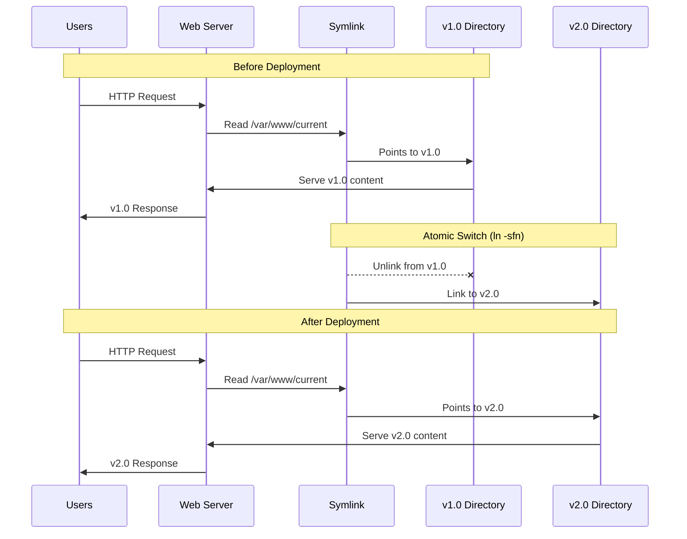

# Web Application Deployment with Symbolic Links

This guide demonstrates how symbolic links enable zero-downtime deployments and easy version management for web applications.

## Traditional Web Application Directory Structure

```
/var/www/
├── releases/
│   ├── v1.0/          # First version
│   ├── v1.1/          # Bug fixes
│   ├── v2.0/          # Major update
│   └── v2.1/          # Latest version
├── current -> v2.1/   # Symbolic link to active version
└── shared/            # Shared assets, logs, configs
    ├── logs/
    ├── uploads/
    └── config/
```

## Step-by-Step Deployment Example

### Initial Setup

```bash
# Create directory structure
sudo mkdir -p /var/www/{releases,shared/{logs,uploads,config}}

# Deploy version 1.0
sudo mkdir /var/www/releases/v1.0
echo "<h1>MyApp v1.0</h1>" | sudo tee /var/www/releases/v1.0/index.html

# Create initial symlink
cd /var/www
sudo ln -s releases/v1.0 current

# Check structure
ls -la /var/www/
```

**Result:**
```
drwxr-xr-x  5 root root 4096 date .
drwxr-xr-x  3 root root 4096 date ..
lrwxrwxrwx  1 root root   12 date current -> releases/v1.0
drwxr-xr-x  3 root root 4096 date releases
drwxr-xr-x  5 root root 4096 date shared
```

### Apache/Nginx Configuration

**Apache VirtualHost:**
```apache
<VirtualHost *:80>
    ServerName myapp.com
    DocumentRoot /var/www/current    # Points to symlink!
    
    <Directory /var/www/current>
        AllowOverride All
        Require all granted
    </Directory>
    
    # Logs in shared directory
    ErrorLog /var/www/shared/logs/error.log
    CustomLog /var/www/shared/logs/access.log combined
</VirtualHost>
```

**Nginx Configuration:**
```nginx
server {
    listen 80;
    server_name myapp.com;
    root /var/www/current;    # Points to symlink!
    index index.html index.php;
    
    # Logs in shared directory
    access_log /var/www/shared/logs/access.log;
    error_log /var/www/shared/logs/error.log;
    
    location / {
        try_files $uri $uri/ =404;
    }
}
```

## Zero-Downtime Deployment Process

### Deploy Version 2.0

```bash
# 1. Deploy new version (while v1.0 is still running)
sudo mkdir /var/www/releases/v2.0
echo "<h1>MyApp v2.0 - New Features!</h1>" | sudo tee /var/www/releases/v2.0/index.html

# 2. Test new version (optional - direct access)
curl http://localhost/releases/v2.0/

# 3. Atomic switch - this is the magic!
cd /var/www
sudo rm current                    # Remove old symlink
sudo ln -s releases/v2.0 current  # Create new symlink

# Alternative one-liner atomic switch:
sudo ln -sfn releases/v2.0 current
```

### What Happens During the Switch:



## Advanced Deployment Scenarios

### Blue-Green Deployment

```bash
# Setup
/var/www/
├── blue/     -> v1.0 (currently live)
├── green/    -> empty (staging)
├── current -> blue/
└── releases/
    ├── v1.0/
    └── v2.0/
```

**Deployment Process:**
```bash
# 1. Deploy to green environment
sudo rm /var/www/green
sudo ln -s releases/v2.0 /var/www/green

# 2. Test green environment
curl -H "Host: staging.myapp.com" http://localhost/

# 3. Switch production traffic
sudo rm /var/www/current
sudo ln -s green /var/www/current

# 4. Keep blue as rollback option
```

### Rollback Strategy

```bash
# Quick rollback to previous version
cd /var/www
sudo ln -sfn releases/v1.0 current

# Or keep a 'previous' symlink for easy rollback
sudo ln -s releases/v1.0 previous
# When deploying v2.0:
sudo mv current previous  # Save current as previous
sudo ln -s releases/v2.0 current

# Rollback becomes:
sudo rm current
sudo mv previous current
```

## Real-World Example: Node.js Application

```bash
#!/bin/bash
# deploy.sh - Production deployment script

APP_DIR="/var/www"
VERSION=$1
RELEASES_DIR="$APP_DIR/releases"
CURRENT_DIR="$APP_DIR/current"
SHARED_DIR="$APP_DIR/shared"

if [ -z "$VERSION" ]; then
    echo "Usage: $0 <version>"
    exit 1
fi

# 1. Create version directory
VERSION_DIR="$RELEASES_DIR/$VERSION"
mkdir -p "$VERSION_DIR"

# 2. Deploy application code
rsync -av --exclude='node_modules' --exclude='.git' \
    /home/deploy/myapp/ "$VERSION_DIR/"

# 3. Install dependencies
cd "$VERSION_DIR"
npm ci --production

# 4. Link shared resources
ln -sfn "$SHARED_DIR/uploads" "$VERSION_DIR/uploads"
ln -sfn "$SHARED_DIR/logs" "$VERSION_DIR/logs"
ln -sfn "$SHARED_DIR/config/database.json" "$VERSION_DIR/config/database.json"

# 5. Run database migrations (if needed)
npm run migrate

# 6. Test the new version
npm test || { echo "Tests failed!"; exit 1; }

# 7. Atomic switch
ln -sfn "$VERSION_DIR" "$CURRENT_DIR"

# 8. Reload web server (graceful restart)
sudo systemctl reload nginx
# or for Node.js with PM2:
# pm2 restart myapp

# 9. Cleanup old versions (keep last 3)
cd "$RELEASES_DIR"
ls -t | tail -n +4 | xargs rm -rf

echo "Deployment of $VERSION completed successfully!"
```

## Benefits of Symlink-Based Deployment

### 1. **Atomic Deployments**
- Single filesystem operation (`ln -sfn`)
- No partial states or corruption
- Instant switchover

### 2. **Zero Downtime**
- Web server keeps serving from old version during deployment
- Switch happens in milliseconds
- No service interruption

### 3. **Easy Rollbacks**
- Keep multiple versions available
- Rollback is just another symlink change
- No need to redeploy previous version

### 4. **Testing in Production Environment**
- Test new version via direct path access
- Same server, same configuration
- Validate before switching traffic

### 5. **Shared Resources**
- Logs, uploads, configs shared across versions
- No duplication of static assets
- Consistent data location

## Common Patterns and Best Practices

### Version Naming Conventions
```bash
# Semantic versioning
v1.0.0, v1.0.1, v2.0.0

# Timestamp-based
20240822-143052, 20240822-150134

# Git-based
commit-abc1234, release-v2.1.0-abc1234
```

### Health Checks
```bash
# Test new version before switching
check_health() {
    local version_dir=$1
    # Test if app responds correctly
    if curl -f "http://localhost/releases/$version_dir/health"; then
        return 0
    else
        return 1
    fi
}

# Only switch if health check passes
if check_health "$VERSION"; then
    ln -sfn "releases/$VERSION" current
else
    echo "Health check failed, aborting deployment"
    exit 1
fi
```

### Automated Deployment Pipeline

```yaml
# Example GitLab CI/CD
deploy:
  stage: deploy
  script:
    - VERSION=$(date +%Y%m%d-%H%M%S)
    - rsync -av . user@server:/var/www/releases/$VERSION/
    - ssh user@server "cd /var/www && ln -sfn releases/$VERSION current"
    - ssh user@server "sudo systemctl reload nginx"
  only:
    - main
```

## Troubleshooting Common Issues

### 1. **Broken Symlinks**
```bash
# Check if current symlink is valid
file /var/www/current
# Output: /var/www/current: symbolic link to releases/v2.0

# Find broken symlinks
find /var/www -type l -exec test ! -e {} \; -print
```

### 2. **Permission Issues**
```bash
# Ensure proper ownership
sudo chown -h www-data:www-data /var/www/current
sudo chown -R www-data:www-data /var/www/releases/v2.0/
```

### 3. **Web Server Cache**
```bash
# Clear various caches after deployment
sudo systemctl reload nginx        # Nginx
sudo systemctl reload apache2      # Apache
sudo -u www-data php artisan cache:clear  # Laravel
```

This symlink-based deployment strategy is used by major platforms like Capistrano (Ruby), Deployer (PHP), and many custom deployment tools. It provides reliability, speed, and flexibility for modern web application deployments.
